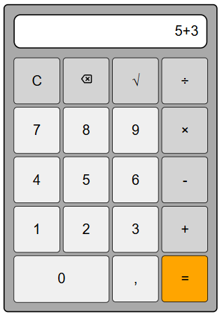

[](https://codecov.io/gh/erlesando/collaboratecalculator)

<a href="https://github.com/erlesando/collaboratecalculator"></a>



# Collaborate Calculator

## Description

This project is a simple calculator designed for use in various tests and exams. The calculator can perform the following operations:
- Addition
- Subtraction
- Multiplication
- Division
- Square root calculation

The calculator can be used both with keys and buttons, providing flexibility in how you interact with it. It respects the order of operations, performing multiplications and divisions before additions and subtractions. If a division by zero is attempted, an error will occur, and you can start a new calculation. It is also possible to clear the screen or use the Backspace key to remove the last number or operation.

## Getting Started

### Prerequisites

To get started with this project, you need to have Node.js and npm installed on your machine.

### Installation

Clone the repository and install the dependencies:

```bash
git clone https://github.com/erlesando/collaboratecalculator.git
cd collaboratecalculator
npm install
```

### Developing

To start a development server:

```bash
npm run dev

# or start the server and open the app in a new browser tab
npm run dev -- --open
```

### Building

To create a production version of your app:

```bash
npm run build
```

You can preview the production build with:

```bash
npm run preview
```

> To deploy your app, you may need to install an [adapter](https://svelte.dev/docs/kit/adapters) for your target environment.

## Authors and Acknowledgements

This project was developed by Terje Monsen, Bjørn Pettersen and Erle Sandø.

## License

This project is licensed under the MIT License - see the [LICENSE](LICENSE) file for details.
